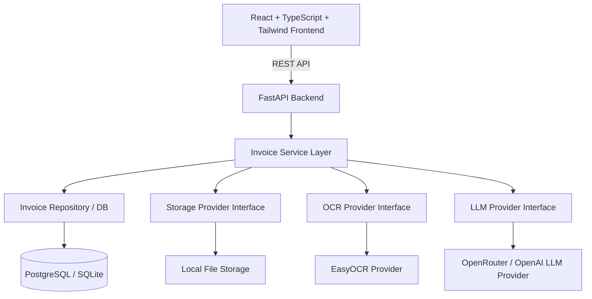

# Implementation Plan - DocuMind AI

Building a production-quality, modular AI-powered Invoice Processing SaaS platform ("DocuMind AI") with FastAPI, PostgreSQL, EasyOCR, OpenRouter LLM, React, TypeScript, and Tailwind CSS.

## User Review Required

> [!IMPORTANT]
> **Incremental Milestone Execution**: As requested, development will proceed in clear, logical milestones. After completing each milestone, we will present the architecture, rationale, and improvements before moving on.

> [!NOTE]
> **LLM Provider & API Keys**: OpenRouter API key and model selection (`OPENROUTER_API_KEY`, `OPENROUTER_MODEL`) are configured through environment variables. Mock providers are available only when explicitly selected with `LLM_PROVIDER=mock`.

---

## Architecture & System Overview



---

## Proposed Folder Structure

```
d:/Files and Docs/B.Tech/Projects/AI-Invoice-Reader/
├── backend/
│   ├── app/
│   │   ├── api/
│   │   │   └── v1/
│   │   │       ├── endpoints/
│   │   │       │   ├── health.py
│   │   │       │   ├── invoices.py
│   │   │       │   └── export.py
│   │   │       └── router.py
│   │   ├── core/
│   │   │   ├── config.py
│   │   │   ├── exceptions.py
│   │   │   └── logging.py
│   │   ├── db/
│   │   │   ├── base.py
│   │   │   └── session.py
│   │   ├── models/
│   │   │   └── invoice.py
│   │   ├── repositories/
│   │   │   └── invoice_repository.py
│   │   ├── schemas/
│   │   │   ├── invoice.py
│   │   │   └── ocr.py
│   │   ├── services/
│   │   │   ├── storage/
│   │   │   │   ├── base.py
│   │   │   │   └── local_storage.py
│   │   │   ├── ocr/
│   │   │   │   ├── base.py
│   │   │   │   └── easy_ocr.py
│   │   │   ├── llm/
│   │   │   │   ├── base.py
│   │   │   │   └── openrouter.py
│   │   │   ├── invoice_service.py
│   │   │   └── export_service.py
│   │   ├── utils/
│   │   └── main.py
│   ├── alembic/
│   ├── uploads/
│   ├── requirements.txt
│   ├── .env.example
│   └── Dockerfile
├── frontend/
│   ├── src/
│   │   ├── api/
│   │   │   └── invoiceApi.ts
│   │   ├── components/
│   │   │   ├── common/
│   │   │   ├── upload/
│   │   │   ├── invoice/
│   │   │   └── layout/
│   │   ├── hooks/
│   │   │   └── useInvoices.ts
│   │   ├── pages/
│   │   │   ├── LandingPage.tsx
│   │   │   ├── UploadPage.tsx
│   │   │   ├── InvoiceViewerPage.tsx
│   │   │   ├── HistoryPage.tsx
│   │   │   └── SettingsPage.tsx
│   │   ├── types/
│   │   │   └── invoice.ts
│   │   ├── utils/
│   │   ├── App.tsx
│   │   ├── main.tsx
│   │   └── index.css
│   ├── package.json
│   ├── tailwind.config.js
│   ├── vite.config.ts
│   └── Dockerfile
└── docker-compose.yml
```

---

## Milestone Roadmap

### Milestone 1: Foundations & Architecture Skeleton [COMPLETED]
- [x] Initialize Python Virtual Environment & Backend directory layout.
- [x] Configure `core/config.py` (Pydantic Settings for DB, OpenRouter, Storage).
- [x] Set up SQLAlchemy database connection & `Invoice` model schema.
- [x] Create Abstract Interfaces for Storage (`BaseStorageProvider`), OCR (`BaseOCRProvider`), and LLM (`BaseLLMProvider`).
- [x] Build FastAPI app shell with CORS, custom exception handlers, and `/api/v1/health` endpoint.
- [x] Initialize Frontend using Vite + React + TypeScript + Tailwind CSS.
- [x] Setup Frontend router, query client, theme context, and base layout.

### Milestone 1.5: Enterprise Architectural Refinements [COMPLETED]
- [x] **Testing Infrastructure (`backend/tests/`)**: Isolated in-memory SQLite fixtures (`conftest.py`), mock PDF/PNG byte fixtures, test suits for `api/`, `services/`, `repositories/`, `ocr/`, `llm/`.
- [x] **File Validation Layer (`app/validators/file_validator.py`)**: Strict MIME type, extension, empty file, magic byte header inspection (`%PDF`, `\x89PNG`, `\xff\xd8\xff`), and sanitized unique filename generation.
- [x] **Prompt Management (`app/prompts/` & `app/core/prompt_manager.py`)**: Decoupled prompt template files (`invoice_extraction_v1.txt`) with dynamic loading & formatting via `PromptManager`.
- [x] **Structured Logging (`app/core/logging.py`)**: ContextVar `request_id` tracking, execution timer context manager `log_timing()`, structured JSON/Key-Value formatting, zero print statements.
- [x] **Auth Readiness (`app/auth/` & `app/users/`)**: `User` ORM model, JWT security placeholders, and `get_current_user` FastAPI dependency.
- [x] **Dependency Injection (`app/api/deps.py`)**: Provider factory functions (`get_storage_provider`, `get_ocr_provider`, `get_llm_provider`).

### Milestone 2: OCR, LLM Processing & Backend API Endpoints [COMPLETED]
- [x] Implement `LocalStorageProvider` for handling file uploads (PDF, PNG, JPG, JPEG).
- [x] Implement `EasyOCRProvider` with multi-page/image processing, language detection, and text assembly.
- [x] Implement `OpenRouterLLMProvider` using JSON Schema structural extraction for invoice items, totals, vendor/customer metadata, and confidence scores.
- [x] Implement `POST /api/v1/invoices/upload`, `POST /api/v1/invoices/{id}/extract`, `POST /api/v1/invoices/process` (upload + extract), `GET /api/v1/invoices/{id}`, and `GET /api/v1/invoices`.
- [x] Implement unit & integration test suite verifying end-to-end OCR + AI flow.

### Milestone 3: Modern SaaS Frontend & User Experience [COMPLETED]
- [x] Build responsive Layout with Sidebar, Dark Mode Toggle, and Navigation.
- [x] Build Landing Page highlighting AI invoice extraction features and interactive preview CTA.
- [x] Build Upload Page with drag-and-drop file zone, live upload progress, and real-time processing indicator.
- [x] Build Invoice Viewer Page with splitscreen document viewer + editable structured fields, line-items table, and confidence badges.
- [x] Build History Page with search filter, status filtering, table sorting, and pagination.
- [x] Build Settings Page for local configurations and API credentials.

### Milestone 4: Multi-Format Data Export & Docker Deployment [COMPLETED]
- [x] Implement Export Service (`CSV`, `Excel` via `openpyxl` v3.1.5).
- [x] Add export API endpoint `GET /api/v1/invoices/{id}/export?format={csv|xlsx}` with `Response` download headers.
- [x] Frontend `invoiceApi.ts` `exportInvoice()` using Blob + Object URL browser download.
- [x] `InvoiceViewerPage.tsx` Export dropdown with CSV, Excel, and JSON options + loading state + toast feedback.
- [x] Backend multi-stage `Dockerfile` (builder + lean runtime, non-root user).
- [x] Frontend `Dockerfile` (Vite build + Nginx) + `nginx.conf` with `/api` proxy and SPA fallback.
- [x] `docker-compose.yml` orchestrating PostgreSQL 16, FastAPI backend, and Nginx frontend.
- [x] `.env.example` documenting all required environment variables.
- [x] `.dockerignore` files for both services.
- [x] Frontend build verified: 0 TypeScript errors, 1551 modules.

---

## Verification Plan

### Automated Tests
- Run FastAPI endpoint test suite using `pytest`:
  - Test health check response.
  - Test upload endpoint with sample PNG/PDF image.
  - Test schema validation on invalid upload formats.
- Run frontend build verification:
  - `npm run build` to verify zero TypeScript or bundle errors.

### Manual Verification
- Test file upload with actual invoice samples (PNG, JPG, PDF).
- Verify OCR text extraction accuracy and LLM JSON parsing.
- Verify CSV and Excel download files open cleanly in Excel/Google Sheets.
- Verify visual dark mode aesthetic, micro-animations, and dynamic UI responsiveness.


### Improvements:
#### Highest priority:
------------------------
- [x] Rotate the OpenRouter API key

- [x] Disable believable mock fallback when an API key is missing

- [x] Add confidence and validation safeguards

- [x] Improve extraction prompt and schema handling

- [x] Add regression tests using real invoice samples

#### Important reliability improvements:
-----------------------------------------
- [x] Improve PDF/OCR handling

- [x] Add retry and recovery flows

- [x] Improve API error classification

- [x] Add database migrations

- [x] Add structured request tracing

- [x] Improve invoice review UX

- [x] Fix search scope

- [x] Improve export behavior

- [x] Improve settings transparency

- [x] Add frontend automated tests

#### Maintainability and product direction:
--------------------------------------------
- [x] Create a processor interface for future document types

- [x] Add user-editable extraction corrections

- [x] Add data retention controls

- [x] Improve deployment configuration

- [x] Update project documentation
